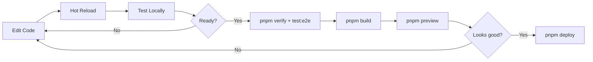

# 🚀 Guía de Inicio Rápido

> Configuración inicial del proyecto DreamFolio Astro en tu entorno local.

---

## 📋 Prerrequisitos

| Herramienta | Versión | Verificar | De dónde sale |
| ------------- | --------- | ----------- | ---------------- |
| **Node.js** | 24.x | `node --version` | `.nvmrc` y `engines` en `package.json` |
| **pnpm** | 11.27.0 | `pnpm --version` | `packageManager` en `package.json` |
| **Git** | 2.x | `git --version` | — |

---

## 🔧 Instalación

### 1. Clonar el Repositorio

```bash
git clone https://github.com/dreamcoder08/DreamFolio.git
cd DreamFolio
```

### 2. Instalar Dependencias

```bash
pnpm install
```

### 3. Variables de Entorno

```bash
# No required environment variables for the public portfolio.
```

> 💡 **Nota:** no hay backend público ni credenciales requeridas. El contacto abre un borrador `mailto:` local. Las únicas variables opcionales son las de despliegue (`SITE_URL`, `SITE_BASE`) y las de analítica (`PUBLIC_UMAMI_*`), y se configuran en la plataforma de despliegue, no en un archivo `.env` versionado.

### 4. Iniciar Servidor de Desarrollo

```bash
pnpm dev
```

Abre [http://localhost:4321](http://localhost:4321) en tu navegador.

---

## 📂 Estructura del Proyecto

```text
DreamFolio/
├── docs/                   # 📚 Documentación (estás aquí)
├── public/                 # 📁 Assets estáticos, incluido theme-init.js
├── src/
│   ├── components/ui/      # 🧩 Los tres componentes: Icon, Navbar, ProfileCard
│   ├── content.config.ts   # 🗂️ Colección tipada (Zod) sobre data/projects.json
│   ├── data/               # 📄 projects.json
│   ├── layouts/            # 📐 BaseLayout.astro
│   ├── lib/                # 📦 site, icons, project-*, analytics, astro-mode
│   ├── pages/              # 📄 index, 404, projects/, projects/[id], robots.txt
│   └── styles/             # 🎨 global.css (tokens @theme) + portfolio.css
├── astro.config.mjs        # ⚙️ Configuración Astro
└── package.json            # 📦 Dependencias y scripts
```

No hay framework de cliente: cada componente es un archivo `.astro` que se renderiza a HTML durante el build.

---

## 🛠️ Scripts Disponibles

| Comando | Descripción |
| --------- | ------------- |
| `pnpm dev` | Servidor de desarrollo en el puerto 4321 |
| `pnpm build` | Build de producción a `dist/` |
| `pnpm preview` | Preview del build de producción |
| `pnpm verify` | Build + typecheck (`astro sync && tsc --noEmit`) — el gate antes de publicar |
| `pnpm check` | Solo el typecheck |
| `pnpm test:unit` | Tests unitarios con `node --test` |
| `pnpm test:e2e` | Suite de Playwright (construye antes con `SITE_BASE=/`) |
| `pnpm format` / `pnpm format:check` | Aplica / verifica el formato con Prettier |
| `pnpm secret:scan` | Escaneo de secretos con gitleaks |
| `pnpm clean` | Limpia `dist/` y la caché |
| `pnpm deploy` | Deploy a Vercel (producción) |
| `pnpm deploy:staging` | Deploy a Vercel (staging) |
| `pnpm deploy:pages` | Build para GitHub Pages |
| `pnpm lighthouse` | Análisis Lighthouse local contra el puerto 4321 |

---

## 🔄 Flujo de Desarrollo


```mermaid
flowchart LR
    A[Edit Code] --> B[Hot Reload]
    B --> C[Test Locally]
    C --> D{Ready?}
    D -->|No| A
    D -->|Yes| E[pnpm verify + test:e2e]
    E --> F[pnpm build]
    F --> G[pnpm preview]
    G --> H{Looks good?}
    H -->|No| A
    H -->|Yes| I[pnpm deploy]
```

---

## 🎨 Añadir Nuevos Componentes

Todo componente es un archivo `.astro` dentro de `src/components/ui/`.

```astro
---
// src/components/ui/NewSection.astro
interface Props {
  title: string;
}

const { title } = Astro.props;
---

<section class="py-20">
  <h2 class="text-3xl font-bold">{title}</h2>
  <slot />
</section>
```

### Si algo necesita el navegador

No hay framework de cliente ni directivas `client:*` en este repositorio. Cuando una interacción necesita el navegador, la forma establecida es un script vainilla pequeño y acotado: el `<script>` de `Navbar.astro` (menú móvil y toggle de tema) y `public/theme-init.js`, que aplica el tema antes del primer pintado. Incorporar un framework es una decisión de arquitectura: requiere una interacción que el JavaScript vainilla no pueda expresar, y ese argumento todavía no se hizo.

---

## 📊 Verificar Performance

### Lighthouse Local

```bash
# Build y preview
pnpm build && pnpm preview

# En otra terminal, correr Lighthouse
pnpm lighthouse
```

### Web Vitals en Consola

Abre DevTools (F12) y observa los logs de performance en la consola durante desarrollo.

---

## ❓ Solución de Problemas

### Error: Cannot find module

```bash
# Limpiar artefactos de build
pnpm clean
pnpm install
```

### El formulario no envía a un backend

Es intencional. No hay backend público: el contacto abre un borrador `mailto:` con asunto y cuerpo prellenados, sin credenciales y sin dependencias de servicio.

### Build falla en Vercel

Verifica que Vercel use `pnpm install` y `pnpm build`, como está definido en `vercel.json`.

---

## 📚 Próximos Pasos

- [Mejores Prácticas](./best-practices.md) - Convenciones del stack real
- [Arquitectura](../architecture/README.md) - Decisiones técnicas
- [Componentes](../components/README.md) - Catálogo de UI
- [Helpers de librería](../lib/README.md) - Qué hay en `src/lib/`
